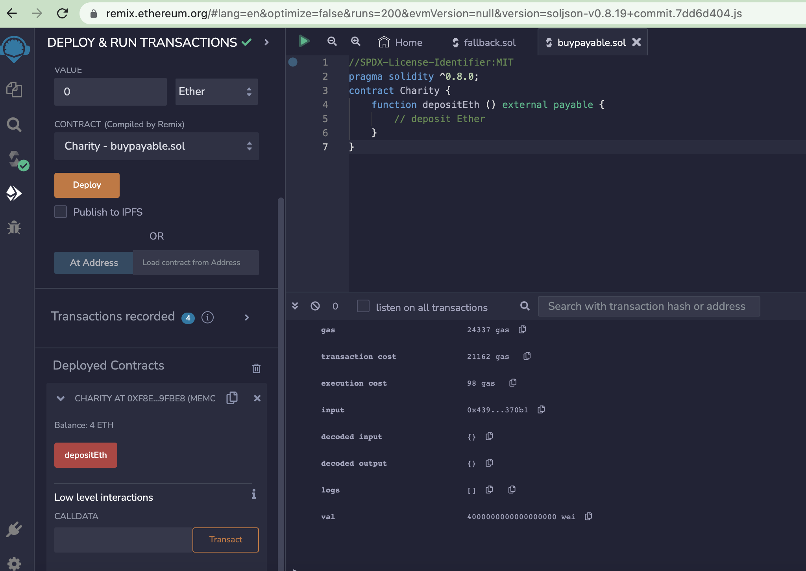

# Payable Function Behavior

The term "payable" in defining a function is one of keywords that affects function behavior. The other keywords are pure, constant and view.

We use the term payable to accept incoming ether payments. Functions not declared as payable will reject incoming payments. 
There are two exceptions, due to design decisions in the EVM: coinbase payments and SELFDESTRUCT inheritance will be paid even
if the fallback function is not declared as payable, but this makes sense because code execution is not part of those payments anyway.

Here's the sample syntax of a function.The payable appears after function's visibility keywords (public, private, internal and external)

function FunctionName([parameters]) {public|private|internal|external}
[pure|view|payable] [modifiers] [returns (return types)]

*Remix illustration below* *
